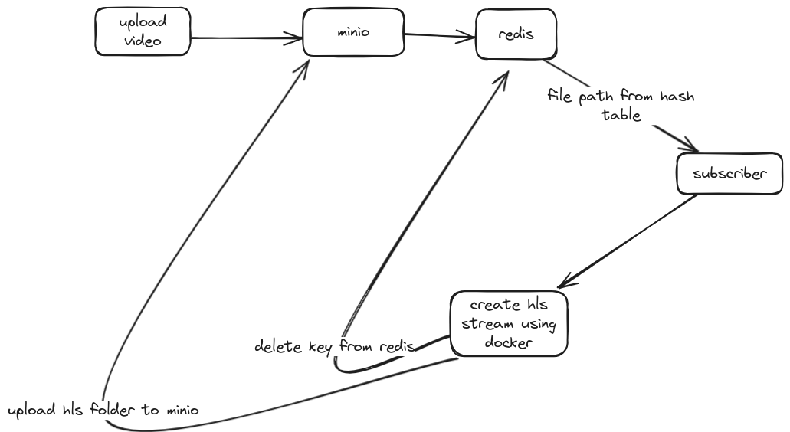

# Video Upload and HLS Stream Creation Flow

This document explains the process flow for uploading a video, creating an HLS stream using Docker, and managing file paths and keys using MinIO and Redis.

## Process Flow

1. **Upload Video**
   - The initial step involves uploading a video to the MinIO server.
2. **MinIO Storage**

   - The uploaded video is stored in MinIO, an object storage service.

3. **Redis Hash Table**

   - MinIO stores the file path of the uploaded video in a Redis hash table. This allows for easy retrieval of file paths.

4. **Subscriber Retrieval**

   - A subscriber retrieves the file path from the Redis hash table. This subscriber is responsible for initiating the HLS stream creation process.

5. **Create HLS Stream Using Docker**

   - Using the retrieved file path, a Docker container is utilized to create an HLS stream from the uploaded video. This involves segmenting the video into smaller chunks suitable for streaming.

6. **Upload HLS Folder to MinIO**

   - The resulting HLS stream, which is a folder containing the segmented video files, is uploaded back to MinIO for storage.

7. **Delete Key from Redis**
   - Once the HLS stream creation is completed, the associated key is deleted from Redis to maintain a clean and updated hash table.
